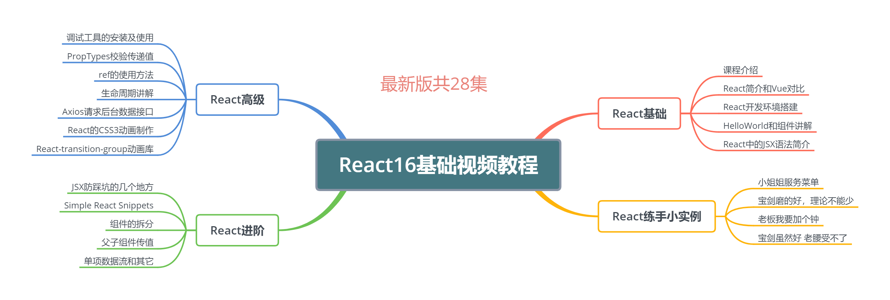

react总结：
  - 组件化编写
  - 不直接操作DOM元素，通过数据驱动，改变界面效果（响应式设计和数据绑定=》要通过绑定事件对变量赋值）
  - 绑定事件（可能出现的问题：1.this指向不对，你需要重新用bind设置一下指向(ES6的语法);2.React中改变值需要使用this.setState方法）
  - react禁止直接操作state的
  - 单项数据流（父组件向子组件传递的值，在子组件中只能读取，不能修改）
  - 函数式编程（代码更清晰，每个功能都是一个函数；代码测试代理方便，更容易实现前端自动化测试）
  
react快速生成插件：React Snippets
  
**react要求组件外层包裹原则，即一个组件的最外层进行包裹；可以使用Fragment标签解决外层不显示包裹**


### 在mac系统下，react用create-react-app my-app（my-app是你新建项目的名字）创建项目时，出现：-bash: create-react-app: command not found
 
 > 此时用npm init react-app my-app命令即可。
 
### 创建react项目
 
 ```markdown
  npm install -g create-react-app
  mkdir ReactDemo  //创建ReactDemo文件夹
  create-react-app demo01   //用脚手架创建React项目
  cd demo01   //等创建完成后，进入项目目录
  npm start   //预览项目，如果能正常打开，说明项目创建成功
 ```
 
### 项目目录介绍

  ```markdown
   README.md :这个文件主要作用就是对项目的说明，已经默认写好了一些东西，你可以简单看看。如果是工作中，你可以把文件中的内容删除，自己来写这个文件，编写这个文件可以使用Markdown的语法来编写。
   
   package.json: 这个文件是webpack配置和项目包管理文件，项目中依赖的第三方包（包的版本）和一些常用命令配置都在这个里边进行配置，当然脚手架已经为我们配置了一些了，目前位置，我们不需要改动。如果你对webpack了解，对这个一定也很熟悉。
   
   package-lock.json：这个文件用一句话来解释，就是锁定安装时的版本号，并且需要上传到git，以保证其他人再npm install 时大家的依赖能保证一致。
   
   gitignore : 这个是git的选择性上传的配置文件，比如一会要介绍的node_modules文件夹，就需要配置不上传。
   
   node_modules :这个文件夹就是我们项目的依赖包，到目前位置，脚手架已经都给我们下载好了，你不需要单独安装什么。
   
   public ：公共文件，里边有公用模板和图标等一些东西。
   
   src ： 主要代码编写文件，这个文件夹里的文件对我们来说最重要，都需要我们掌握。
   
   # public文件夹介绍
   这个文件都是一些项目使用的公共文件，也就是说都是共用的，我们就具体看一下有那些文件吧。
   
   favicon.ico : 这个是网站或者说项目的图标，一般在浏览器标签页的左上角显示。
   
   index.html : 首页的模板文件，我们可以试着改动一下，就能看到结果。
   
   mainifest.json：移动端配置文件，这个会在以后的课程中详细讲解。
   
   # src文件夹介绍
   这个目录里边放的是我们开放的源代码，我们平时操作做最多的目录。
   
   index.js : 这个就是项目的入口文件，视频中我们会简单的看一下这个文件。
   
   index.css ：这个是index.js里的CSS文件。
   
   app.js : 这个文件相当于一个方法模块，也是一个简单的模块化编程。
   
   serviceWorker.js: 这个是用于写移动端开发的，PWA必须用到这个文件，有了这个文件，就相当于有了离线浏览的功能。
  ```

### JSX
 
 ```markdown
   JSX就是Javascript和XML结合的一种格式。React发明了JSX，可以方便的利用HTML语法来创建虚拟DOM，当遇到<，JSX就当作HTML解析，遇到{就当JavaScript解析.
   
   组件和普通JSX语法区别
   这个说起来也只有简单的一句话，就是你自定义的组件必须首写字母要进行大写，而JSX是小写字母开头的。
   
   存在的问题：
   1.注释：就是在多行或者单行注释外套上{},即在jsx中写javascript代码。所以外出我们套入了{}
   2.class陷阱：把class换成className，它是防止和js中的class类名 冲突
   3.html解析：使用dangerouslySetInnerHTML属性解决，dangerouslySetInnerHTML={{__html:item}}
   4.<label>标签：点击label标签内容直接可以激活文本框，方便输入，按照html的原思想，是直接加ID就可以了，在label标签中使用for,但是会报错，这是因为容易和javascript里的for循环混淆，会提示你使用htmlfor
 ```
 
### 父子组件传值

  ```markdown
  
   # 父组件向子组件传值：靠属性的形式传递
   在子组件中加入content属性，给属性传递{item};在子组件文件中使用this.props.content的形式接收

   # 子组件向父组件传递数据：靠传递父组件的方法（子组件调用父组件中的方法实现）
   在组件调用时，将父组件中的方法传递给子组件（跟属性传递一样）；在子组件中可以使用this.props.方法
   
   # PropTypes校验传递值
   在子组件class类下面使用类型+propTypes={},
   
   MyComponent.propTypes = {
     // 你可以将属性声明为 JS 原生类型，默认情况下
     // 这些属性都是可选的。
     optionalArray: PropTypes.array,
     optionalBool: PropTypes.bool,
     optionalFunc: PropTypes.func,
     optionalNumber: PropTypes.number,
     optionalObject: PropTypes.object,
     optionalString: PropTypes.string,
     optionalSymbol: PropTypes.symbol,
     
     // 一个对象可以是几种类型中的任意一个类型
       optionalUnion: PropTypes.oneOfType([
         PropTypes.string,
         PropTypes.number,
         PropTypes.instanceOf(Message)
       ]),
       
     // 你可以在任何 PropTypes 属性后面加上 `isRequired` ，确保
     // 这个 prop 没有被提供时，会打印警告信息。
     requiredFunc: PropTypes.func.isRequired,
   }
   
   // 指定 props 的默认值：
   MyComponent.defaultProps = {
     name: 'Stranger'
   };
  ```
  
### React developer tools测试工具

  ```markdown
   # React developer tools的三种状态
   1.灰色： 这种就是不可以使用，说明页面不是又React编写的。
   2.黑色: 说明页面是用React编写的，并且处于生成环境当中。
   3.红色： 说明页面是用React编写的，并且处于调试环境当中。
    
  ```
  
### ref使用方法

  ```markdown
    # 代替原来的e.target.value
    使用ref来进行，需要现在JSX中进行绑定， 绑定时最好使用ES6语法中的箭头函数，这样可以简洁明了的绑定DOM元素;
    ref={(input)=>{this.input=input}}
    this.input.value = e.target.value
    
    # ref使用中的坑
    setState是一个异步函数
    
    this.setState({
            list:[...this.state.list,this.state.inputValue],
            inputValue:''
            //关键代码--------------start
    },()=>{
            console.log(this.ul.querySelectorAll('div').length)
    })
    
  ```

### react生命周期：在某一个时刻组件会自动调用执行的函数
 
**React声明周期的四个大阶段：**
 - 1.Initialization:初始化阶段。
 - 2.Mounting: 挂在阶段。
 - 3.Updation: 更新阶段。
 - 4.Unmounting: 销毁阶段


> Initialization阶段
 - render()函数，就是一个生命周期函数，它在state发生改变时自动执行。这就是一个标准的自动执行函数。
 - constructor不算生命周期函数。constructor我们叫构造函数，它是ES6的基本语法。虽然它和生命周期函数的性质一样，但不能认为是生命周期函数。把它看成React的Initialization阶段，定义属性（props）和状态(state)

> Mounting阶段:挂载阶段，伴随着整个虚拟DOM的生成，它里边有三个小的生命周期函数：
 - componentWillMount: 在组件即将被挂载到页面的时刻执行。
 - render: 页面state或props发生变化时执行。
 - componentDidMount: 组件挂载完成时被执行。
 
 **componentWillMount和componentDidMount这两个生命周期函数，只在页面刷新时执行一次，而render函数是只要有state和props变化就会执行**

> Updation阶段
 - shouldComponentUpdate：函数会在组件更新之前，自动被执行；要求返回一个布尔类型的结果，必须有返回值；返回true，就同意组件更新;返回false,就反对组件更新
 - componentWillUpdate：在组件更新之前
 - componentDidUpdate：在组件更新之后执行，它是组件更新的最后一个环节
 - componentWillReceiveProps：子组件接收了props时执行；组件第一次存在dom中，函数不执行；如果已经存在于dom中，函数才被执行

> Unmounting阶段

 - componentWillUnmount：组件从页面中删除的时候执行（一般子组件中执行；或者跳转页面）

### 组件性能优化（生命周期）
> 子组件中的render函数频繁无用渲染
 - 利用shouldComponentUpdate解决；两个参数：nextProps:变化后的属性;nextState:变化后的状态
 ```jsx
   shouldComponentUpdate(nextProps,nextState){
       if(nextProps.content !== this.props.content){
           return true
       }else{
           return false
       }
      
   }
 ```
 
### axios数据请求

> npm install -save 和 -save-dev分不清
 - npm install xxx: 安装项目到项目目录下，不会将模块依赖写入devDependencies或dependencies。
 - npm install -g xxx: -g的意思是将模块安装到全局，具体安装到磁盘哪个位置，要看 npm cinfig prefix的位置
 - npm install -save xxx：-save的意思是将模块安装到项目目录下，并在package文件的dependencies节点写入依赖。
 - npm install -save-dev xxx：-save-dev的意思是将模块安装到项目目录下，并在package文件的devDependencies节点写入依赖。

 ```jsx
  componentDidMount(){
      axios.post('https://web-api.juejin.im/v3/web/wbbr/bgeda')
          .then((res)=>{console.log('axios 获取数据成功:'+JSON.stringify(res))  })
          .catch((error)=>{console.log('axios 获取数据失败'+error)})
  }
 ```
 
### Axios请求EasyMock
 > EasyMock网站:https://www.easy-mock.com/


### react动画效果

  ```css
    .show{ opacity: 1; transition:all 1.5s ease-in;}
    .hide{opacity: 0; transition:all 1.5s ease-in;}

  ```

### CSS3的keyframes动画
  
  
  ```css
    .show{ animation:show-item 2s ease-in forwards; }
    .hide{ animation:hide-item 2s ease-in forwards; }
    
    @keyframes hide-item{
        0% {
            opacity:1;
            color:yellow;
        }
        50%{
            opacity: 0.5 ;
            color:red;
        }
        100%{
            opacity:0;
            color: green;
        }
    }
    
    @keyframes show-item{
        0% {
            opacity:0;
            color:yellow;
        }
        50%{
            opacity: 0.5 ;
            color:red;
        }
        100%{
            opacity:1;
            color: green;
        }
    }

  ```
  
### React高级-react-transition-group动画效果
 - Transition
 - CSSTransition
  ```markdown
   xxx-enter: 进入（入场）前的CSS样式；
   xxx-enter-active:进入动画直到完成时之前的CSS样式;
   xxx-enter-done:进入完成时的CSS样式;
   xxx-exit:退出（出场）前的CSS样式;
   xxx-exit-active:退出动画知道完成时之前的的CSS样式。
   xxx-exit-done:退出完成时的CSS样式。
  ```
 - TransitionGroup

